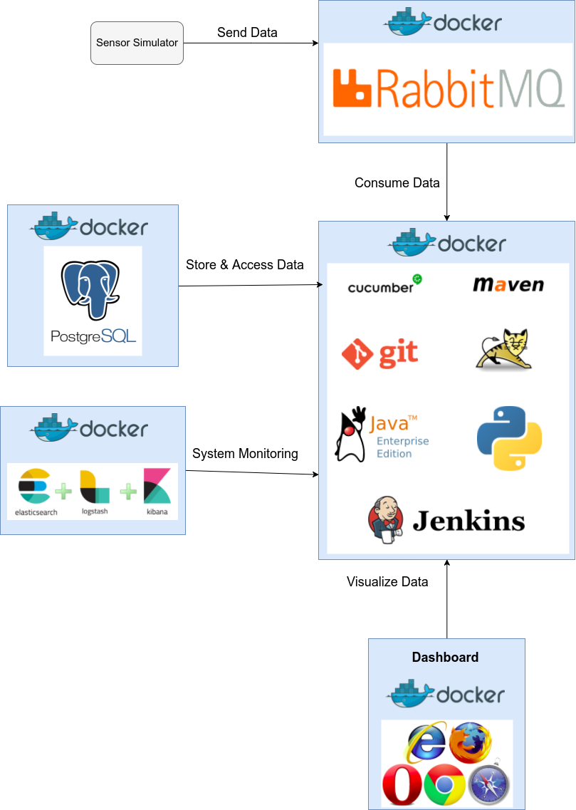

0-CLIENT
=========

Context
-------
In a world of technology the domotic area is growing up tendency, Domotic is a project made by a team of Computer & Telematics Engineering students in response to the challenge made by the subject of Software engineering. 

Objective
----------
The system we implemented offers a way to visualize data gathered by sensors on web browsers referring to a real time monitorization of a house, sending warnings when extreme conditions occur, we can also show some historical data that is stored in our system.

Specifications
---------------
The conditions observable in our system are temperature, humidity, luminosity and smoke levels.
The data obtained is the product of a simulation of data that would come from actual sensors on a house.

Important Features
--------------------
1. Data Storage: Collector of the data of all sensors that will forward it to the dashboard and database.
2. Dashboard: A Dashboard displaying info about the sensors and what is going on, can also show historical data.
3. System Alerts: Specific alerts when the data goes above or under the threshold or other kind of alerts.

Possible risks and challenges
-------------------------------
1. Sensors not working correctly
2. Data values not corresponding to real values

Technical requirements
------------------------
1. Data sensors to collect data from the house.
2. Network access and a web browser.

Architecture
------------------------

	Figure: Architecture

Components
------------
1. Sensor Simulation: Value generation for the simulation of real data.
2. RabbitMQ: message broker used intermediate between data sent from sensors and the server.
3. Server: Where we consume the data from the RabbitMQ queues, process it, store it in a database and send it to the dashboard.
4. Tomcat: Java web Server where our dashboard is deployed.
5. Cucumber: Testing software tool used by computer programmers for testing other software. It runs automated acceptance tests written in a behavior-driven development style. Central to the Cucumber BDD approach is its plain language parser called Gherkin.
6. Jenkins: helps to automate the software development process with continuous integration.
7. Maven: software project management and comprehension tool
8. ELK Stack -The ELK stack consists of Elasticsearch, Logstash, and Kibana (System Monitoring). 
9. Database: PostgreSQL database
10. Dashboard: Where the data and warnings are displayed
11. Alarms: Python Scripts parsing the data looking for values above/under the threshold.
	
Everything is running in docker so it’s easy to people reproduce it.Using Docker we can eliminate “it works on my machine” problems when collaborating on code with co-workers.
