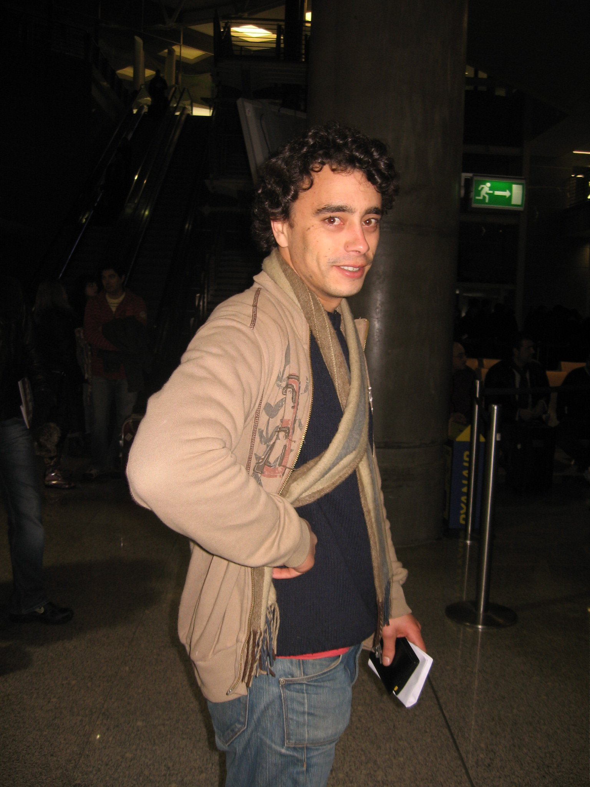
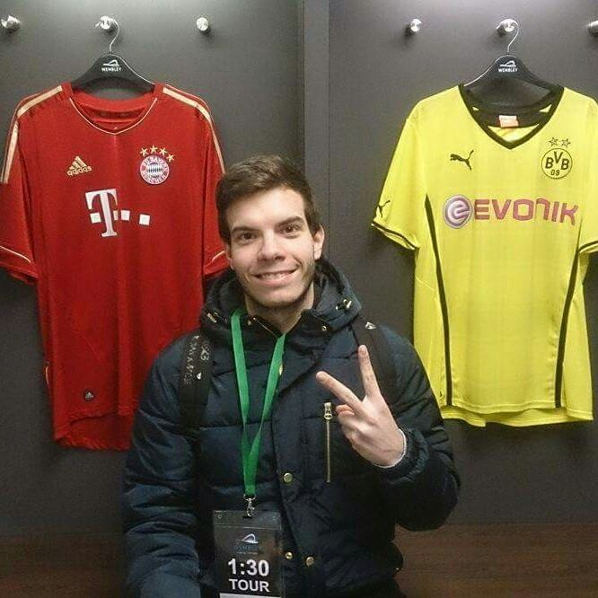

4 - TEAM
========

Team
-----

.. image:: _static/nuno_humberto.jpg
   :width: 15%

1. Francisco Alves, a28618@ua.pt, 28618
2. Pedro Matos, pmatos@ua.pt, 71902
3. Nuno Humberto, nunohumberto@ua.pt, 72537
4. Tiago Bastos, tiagoalexandrebastos@ua.pt, 71770
5. Daniela Sousa, dcsousa@ua.pt, 70158

Total Work
----------
+---------------------+-----------------------------------------------------+--------------------+
|     Elements	      |                    Work done			    |    % of work       |
+=====================+=====================================================+====================+
|    Daniela          | ELK, Tests, Docker-compose & Containers, Processing |			 |
|		      |	Units, Documentation, JPA, DataBase, Broker	    |		23	 |
+---------------------+-----------------------------------------------------+--------------------+
|     Nuno Humberto   | Dashboard, Websockets, Containers, Gateway,         |		27	 |
|		      |	Processing Units, Broker, Data Generation, JPA      |			 |
+---------------------+-----------------------------------------------------+--------------------+
|    Pedro Matos      | JSF, Tests, Autonomous Deployment, Documentation    |		20	 |
+---------------------+-----------------------------------------------------+--------------------+
|   Tiago Bastos      | ELK, Tests, Autonomous Deployment, Documentation    |		20	 |
+---------------------+-----------------------------------------------------+--------------------+
|   Francisco Alves   | Processing Units, Tests, Documentation		    |		10	 |
+---------------------+-----------------------------------------------------+--------------------+

Week 1 (12-18 March)
^^^^^^^^^^^^^^^^^^^^
+---------------------+-----------------------------------------------------+--------------------+
|     Elements	      |                    Work done			    |    Hours spent     |
+=====================+=====================================================+====================+
| - Daniela           | - General architecture of the system                |			 |
| - Nuno Humberto     |						            |      8h	  	 |
| - Pedro Matos       | 						    |		 	 |
| - Tiago Bastos      | 						    |			 |
| - Francisco Alves   | 						    |		 	 |
+---------------------+-----------------------------------------------------+--------------------+

Week 2 (19-25 March)
^^^^^^^^^^^^^^^^^^^^
+---------------------+-----------------------------------------------------+--------------------+
|     Elements	      |                    Work done			    |    Hours spent     |
+=====================+=====================================================+====================+
| - Daniela           | - General architecture of the system                |			 |
| - Nuno Humberto     |	- Discussion on whitch technologies to use          |      10h  	 |
| - Pedro Matos       | - Discussion on the features of the problem	    |		 	 |
| - Tiago Bastos      | - Preparation of M2				    |			 |
| - Francisco Alves   | 						    |		 	 |
+---------------------+-----------------------------------------------------+--------------------+

Week 3 (26-01 April)
^^^^^^^^^^^^^^^^^^^^
+---------------------+-----------------------------------------------------+--------------------+
|     Elements	      |                    Work done			    |    Hours spent     |
+=====================+=====================================================+====================+
| - Daniela           | - First Exam			                    |			 |
| - Nuno Humberto     |	- Studying other types os technologies	            |      3h	  	 |
| - Pedro Matos       |  						    |		 	 |
| - Tiago Bastos      | 						    |			 |
| - Francisco Alves   | 						    |		 	 |
+---------------------+-----------------------------------------------------+--------------------+

Week 4 (2-8 April)
^^^^^^^^^^^^^^^^^^^^
+---------------------+-----------------------------------------------------+--------------------+
|     Elements	      |                    Work done			    |    Hours spent     |
+=====================+=====================================================+====================+
| - Daniela           | - Presentation of M3              		    |			 |
| - Nuno Humberto     |	- Documentation				            |      10h	  	 |
| - Pedro Matos       | - Simulation of sensor values			    |		 	 |
| - Tiago Bastos      | - Channel of comunication with mosquito		    |			 |
| - Francisco Alves   | - JSF with primefaces and jetty			    |		 	 |
+---------------------+-----------------------------------------------------+--------------------+

Week 5 (9-15 April)
^^^^^^^^^^^^^^^^^^^^
+---------------------+-----------------------------------------------------+--------------------+
|     Elements	      |                    Work done			    |    Hours spent     |
+=====================+=====================================================+====================+
| - Daniela           | 				                    |			 |
| - Nuno Humberto     |						            |      2h	 	 |
| - Pedro Matos       | 						    |		 	 |
| - Tiago Bastos      | - Documentation					    |			 |
| - Francisco Alves   | 						    |		 	 |
+---------------------+-----------------------------------------------------+--------------------+

Week 6 (16-22 April)
^^^^^^^^^^^^^^^^^^^^
+---------------------+-----------------------------------------------------+--------------------+
|     Elements	      |                    Work done			    |    Hours spent     |
+=====================+=====================================================+====================+
| - Daniela           | 				                    |			 |
| - Nuno Humberto     |	- Discussion on whitch technologies to use          |      10h	  	 |
| - Pedro Matos       | - Kafka vs mosquito vs rabbitmq			    |		 	 |
| - Tiago Bastos      | - postgres					    |			 |
| - Francisco Alves   |	- jsf 						    |		 	 |
+---------------------+-----------------------------------------------------+--------------------+

Week 7 (23-29 April)
^^^^^^^^^^^^^^^^^^^^
+---------------------+-----------------------------------------------------+--------------------+
|     Elements	      |                    Work done			    |    Hours spent     |
+=====================+=====================================================+====================+
| - Daniela           | 				                    |			 |
| - Nuno Humberto     |	- General architecture			            |      8h	  	 |
| - Pedro Matos       | - REST gateway					    |		 	 |
| - Tiago Bastos      | - Channel of communication with rabbit		    |			 |
| - Francisco Alves   | - jpa with postgres				    |		 	 |
+---------------------+-----------------------------------------------------+--------------------+

Week 8 (30- 6 May)
^^^^^^^^^^^^^^^^^^^^
+---------------------+-----------------------------------------------------+--------------------+
|     Elements	      |                    Work done			    |    Hours spent     |
+=====================+=====================================================+====================+
| - Daniela           | 				                    |			 |
| - Nuno Humberto     |	- ELK stack			            	    |      20h	  	 |
| - Pedro Matos       | - Docker containers				    |		 	 |
| - Tiago Bastos      | - jpa with postgres (rabbit subscriber )	    |			 |
| - Francisco Alves   | - Presentation M4				    |		 	 |
+---------------------+-----------------------------------------------------+--------------------+

Week 9 (7- 13 May)
^^^^^^^^^^^^^^^^^^^^
+---------------------+-----------------------------------------------------+--------------------+
|     Elements	      |                    Work done			    |    Hours spent     |
+=====================+=====================================================+====================+
| - Daniela           | 				                    |			 |
| - Nuno Humberto     |	- Documentation			            	    |      10h	  	 |
| - Pedro Matos       | - ELK stack					    |		 	 |
| - Tiago Bastos      | - tests (log4j + junit)				    |			 |
| - Francisco Alves   | 						    |		 	 |
+---------------------+-----------------------------------------------------+--------------------+

Week 10 (14-20 May)
^^^^^^^^^^^^^^^^^^^^
+---------------------+-----------------------------------------------------+--------------------+
|     Elements	      |                    Work done			    |    Hours spent     |
+=====================+=====================================================+====================+
| - Daniela           | 				                    |			 |
| - Nuno Humberto     |	- Dashboard			            	    |      16h	  	 |
| - Pedro Matos       | - cucumber					    |		 	 |
| - Tiago Bastos      | - processing units				    |			 |
| - Francisco Alves   | - log4j with elk				    |		 	 |
+---------------------+-----------------------------------------------------+--------------------+

Week 11 (21-27 May)
^^^^^^^^^^^^^^^^^^^^
+---------------------+-----------------------------------------------------+--------------------+
|     Elements	      |                    Work done			    |    Hours spent     |
+=====================+=====================================================+====================+
| - Daniela           | 				                    |			 |
| - Nuno Humberto     |	- Documentation			            	    |      10h	 	 |
| - Pedro Matos       | - Presentation of M5				    |		 	 |
| - Tiago Bastos      | - comunication between all components		    |			 |
| - Francisco Alves   | - dashboard with websocket			    |		 	 |
+---------------------+-----------------------------------------------------+--------------------+

Week 12 (28-3 June)
^^^^^^^^^^^^^^^^^^^^
+---------------------+-----------------------------------------------------+--------------------+
|     Elements	      |                    Work done			    |    Hours spent     |
+=====================+=====================================================+====================+
| - Daniela           | 				                    |			 |
| - Nuno Humberto     |	- Presentation of final project(M6)        	    |      15h	  	 |
| - Pedro Matos       | - Jenkins					    |		 	 |
| - Tiago Bastos      | - docker and maven with jenkis			    |			 |
| - Francisco Alves   | - syslog with elk				    |		 	 |
+---------------------+-----------------------------------------------------+--------------------+

Week 13 (4-10 June)
^^^^^^^^^^^^^^^^^^^^
+---------------------+-----------------------------------------------------+--------------------+
|     Elements	      |                    Work done			    |    Hours spent     |
+=====================+=====================================================+====================+
|    Daniela          | 				                    |			 |
|     Nuno Humberto   |	- Documentation				            |      9h	 	 |
|    Pedro Matos      | 						    |		 	 |
|   Tiago Bastos      | 						    |			 |
|   Francisco Alves   | 						    |		 	 |
+---------------------+-----------------------------------------------------+--------------------+

