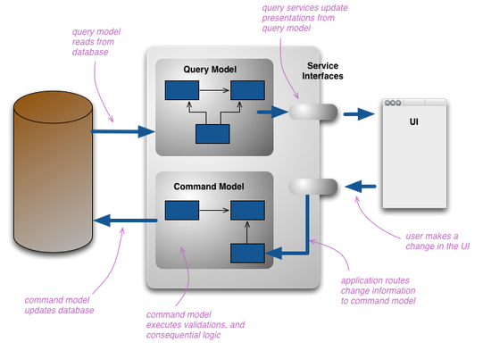

Project Requirements
=====================

Reference architecture
----------------------

.. image:: _static/architecture.png

1. Sensor : data is being acquired along time
2. DataCollector: store the information, Relay the information of processing components & Manage the basic access to the data in the system
3. Dashboard: system can support online mode to allow online monitoring of sensor
4. EventDetector: processing namely to identify relevant events
5. DataProcessor (online) : provide data transformation
6. DataReview : support offline scenarios where it is possible to review information in the system
7. Dataprocessor : support offline scenarios where it is possible to process information in the system

In the offline scenario, system should support strategies to handle big sets of data and asynchronous processing.

Basic architecture requirements
-------------------------------
Enterprise Bus
^^^^^^^^^^^^^^
The system should be decoupled using a Enterprise Bus. The project must use a Enterprise bus (EB) supported on messaging / streaming. The selection of broker main depend on the project.
The objective is to decouple the internal components so that they can be scaled, upgraded and migrated in a transparent manner.

Gateway
^^^^^^^
The system must have a REST based gateway to access the EB from outside ( e.g. external sensor inputs ). It should provide based access control.
The objective is to provide isolation (protocol adaptation, hide details, access control, …) between the internal domain and the outside world.

Processing units
^^^^^^^^^^^^^^^^^
Every projects must contain a external application - i.e. not sharing system servers - that uses the EB .  Can be a python, java application
The objective is to have pluggable processing units that provide specific functions over the data that is on the EB.

Dashboard
^^^^^^^^^^
The system must have a dashboard supported on Java Server Faces. Naturally it should be adapted to the specificities of the project.
The objective is to provide both past and real time information regarding the product being developed.

Persistence
^^^^^^^^^^^^
No specific requirement on the persistence solution although JPA is a natural option.  In some projects, like domotics , a persistence solution is mandatory to ensure that the system preserves a coherent state regardless of performance of the system (e.g.  to recover after a system failure or just validate operation - turn on something that is already turned on… )
The objective is to abstract the effective storage driver, while providing data persistence.

Constrains
----------
CQRS solution
^^^^^^^^^^^^^
Command Query Responsibility Segregation

