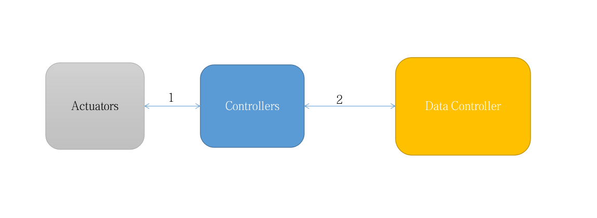

Domotics Scenario
=================

Differences between general projects:
--------------------------------------

1. Connection using Bluetooth for example
2. Messaging solution

Booth sensor inputs and data collector inputs will trigger events that may affect the controllers.

The data controller will keep track of changes and present the information using the dashboard.

More info in:
https://docs.google.com/document/d/10N63LdDQZlmbQ79N9m8CUBayL86JVmNrQ81Z_hyeRTk

Project Requirements
--------------------

.. toctree::
   :maxdepth: 2

   arch
